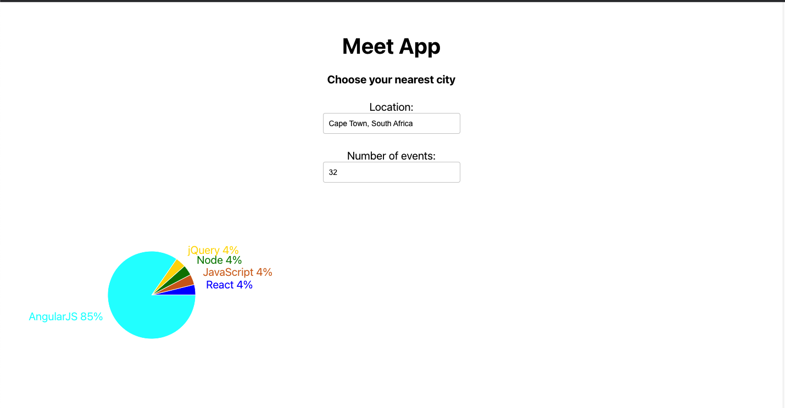
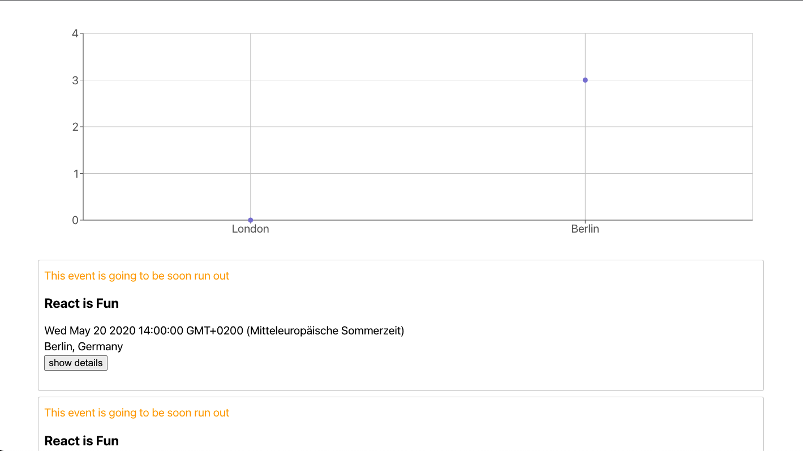

# Meet App

This app was designed to offer users the opportunity to find out any events taking place in their locations based on the Google Calender API.

## <u>Images</u>

## <u>Characteristics</u>

- Serverless function
- PWA
- CI/CD
- Data visualization (scatterplot and pie charts)

## <u>Technologies</u>

- HTML
- CSS
- JavaScript
- React
- Jest (unit tests), Enzyme (integration tests), Puppeteer (end-to-end tests), Cucumber (user acceptance tests)
- Recharts

## Feature 2: Show/hide event's details

### Scenario 1: Collapsed by default

- Given the main page has been loaded
- When the user does not selected anything
- Then the event details will be collapsed

### Scenario 2: Expanding the details

- Given the list of events has been loaded
- When the user clicks on that specific event
- Then the details will expand for that event

### Scenario 3: Collapse the details

- Given the details are expanded
- When the user clicks on the expanded details
- Then the details will collapse again

## Feature 3: Specify number of events

As a user I should have the option to choose the number of events I want to see

### Scenario 1: When user hasn't specified a number, 32 is the default number

- Given the list of events is loaded
- When the user hasn't specified the number of events
- Then the default number of displayed events should be 32

### Scenario 2: User can change the number of events they want to see

- Given the list of events is loaded
- When the user inserts a number in the "number of events" input
- Then the number of displayed events should match the entered number

## Feature 4: Use the App when offline

As a user I want to be able to access events even when being offline

### Scenario 1: Show cached data when being offline

- Given the app has no internet access
- When the user loads the page
- Then the cached data will be accessible and visible

### Scenario 2: Show error when user tries to change the location

- Given the app has no internet access
- When the user changes the location/information
- Then an error will be displayed

## Feature 5: Data Visualization

As a user I want to see the charts with the number of upcoming events in each city

### Scenario 1: Show a chart with a number of upcoming events in each city

- Given the main page has been loaded
- When the user clicks on upcoming events
- Then a chart with upcoming events will be displayed
